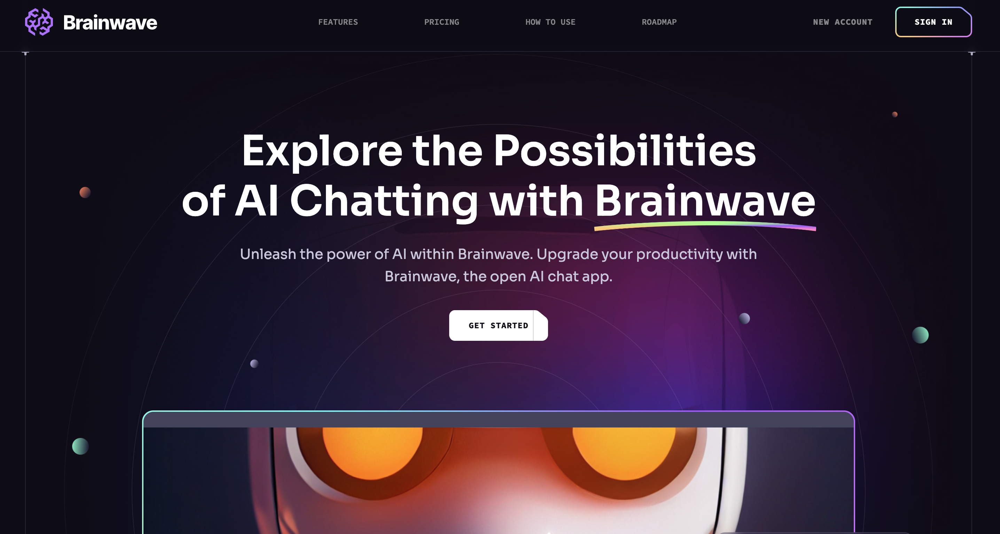

# Brainwave

[](https://brainwaveai-landing.vercel.app/)

**Brainwave** is a Next.js-powered website designed to help users chat smarter, not harder. With BrainwaveCurve, the landing page for Brainwave, you can explore the full potential of AI chatting. Unleash the power of AI to enhance your productivity. Brainwave is an open AI chat app crafted to boost your efficiency and help you achieve more with advanced AI technology.

## Features

- **Ask Anything**: Quickly find answers to your questions without having to search through multiple sources.
- **Explore More**: Discover the full capabilities of Brainwave as it understands and responds to your queries.
- **Improve Everyday**: The app uses natural language processing to understand user queries and provide accurate and relevant responses.
- **Connect Everywhere**: Access the AI chatbot from anywhere, on any device, making it more accessible and convenient.

## Getting Started

### Installation

1. **Clone the repository:**

   ```bash
   git clone https://github.com/your-username/brainwave.git
   cd brainwave
   ```

2. **Install the dependencies:**

   ```bash
   npm install
   ```

3. **Run the development server:**
   ```bash
   npm run dev
   ```
   Open [http://localhost:3000](http://localhost:3000) to view it in the browser. The app will automatically reload if you make edits.

### Contributing

- Fork the repository
- Create a branch
  ```bash
  git checkout -b fix/amazingFix
  ```
- Commit your changes and push to your branch
  ```bash
  git commit -m "made an amazingFix"
  git push origin fix/amazingFix
  ```
- Open a pull request

## License

Distributed under the MIT License. See `LICENSE` for more information.
